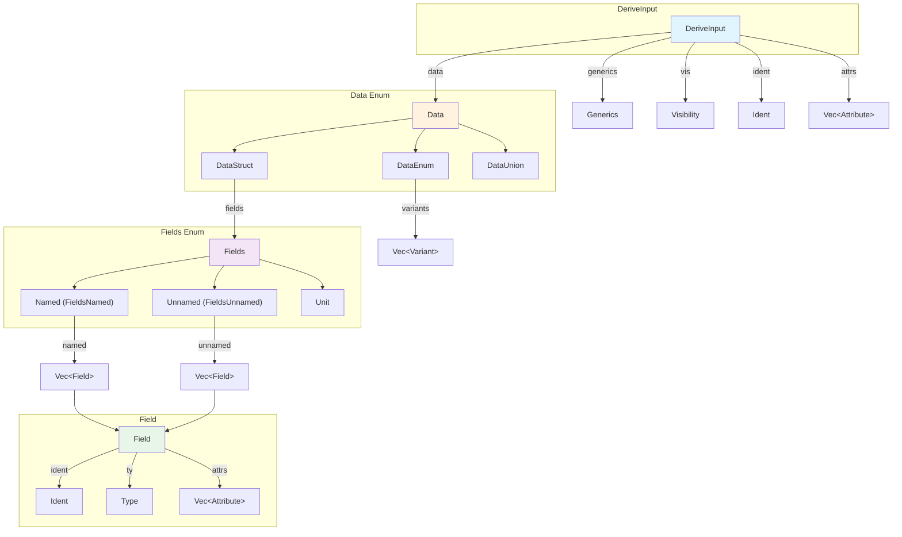

# Chapter 2: Parsing with syn 🔍

## What You'll Learn

- How `syn` parses TokenStream into structured types
- Key types: `DeriveInput`, `Data`, `Fields`, `Attribute`
- The `parse_macro_input!` macro
- Navigating the syn type hierarchy

---

## The Problem: Tokens Are Too Low-Level

After Chapter 1, you know that macros receive `TokenStream`—a flat stream of `Ident`, `Punct`, `Group`, and `Literal` tokens. But imagine writing a derive macro by manually matching these:

```rust
// 😱 DON'T DO THIS
for token in input {
    if let TokenTree::Ident(ident) = token {
        if ident.to_string() == "struct" {
            // Now find the name...
            // Then find the braces...
            // Then parse each field...
            // Handle generics somehow???
            // 💀 This is madness
        }
    }
}
```

We want to say "give me the struct name" and "iterate over its fields"—not play token detective.

**Enter `syn`**: the crate that transforms token chaos into typed, structured data.

---

## DeriveInput: Your Entry Point

For derive macros, `syn` provides `DeriveInput`—a parsed representation of the item your macro is attached to.

### The `parse_macro_input!` Macro

```rust
use proc_macro::TokenStream;
use syn::{parse_macro_input, DeriveInput};

#[proc_macro_derive(MyMacro)]
pub fn derive(input: TokenStream) -> TokenStream {
    // Parse the TokenStream into a DeriveInput
    let input = parse_macro_input!(input as DeriveInput);
    
    // Now we have structured access!
    eprintln!("Struct name: {}", input.ident);
    eprintln!("Generics: {:?}", input.generics);
    
    // ... generate code ...
    TokenStream::new()
}
```

**💡 Aha!** `parse_macro_input!` does the conversion from `proc_macro::TokenStream` to a syn type. If parsing fails, it automatically returns a compile error with good diagnostics.

### What's Inside DeriveInput?

| Field | Type | What It Contains |
|-------|------|-----------------|
| `attrs` | `Vec<Attribute>` | All `#[...]` attributes on the item |
| `vis` | `Visibility` | `pub`, `pub(crate)`, etc. |
| `ident` | `Ident` | The name of the struct/enum |
| `generics` | `Generics` | Type parameters, lifetimes, where clauses |
| `data` | `Data` | The actual struct/enum/union definition |

Let's debug-print a `DeriveInput`:

```rust
#[proc_macro_derive(PrintInput)]
pub fn derive(input: TokenStream) -> TokenStream {
    let input = parse_macro_input!(input as DeriveInput);
    
    eprintln!("=== DeriveInput Debug ===");
    eprintln!("Name: {}", input.ident);
    eprintln!("Visibility: {:?}", input.vis);
    eprintln!("Generics: {} type params", input.generics.type_params().count());
    eprintln!("Data variant: {}", match &input.data {
        syn::Data::Struct(_) => "Struct",
        syn::Data::Enum(_) => "Enum",
        syn::Data::Union(_) => "Union",
    });
    
    TokenStream::new()
}
```

---

## The Data Enum

The `data` field tells you what kind of item you're dealing with:

```rust
pub enum Data {
    Struct(DataStruct),
    Enum(DataEnum),
    Union(DataUnion),
}
```

For derive macros, you'll usually pattern match:

```rust
match &input.data {
    Data::Struct(data_struct) => {
        // Handle struct
        process_struct(&input.ident, &data_struct.fields)
    }
    Data::Enum(data_enum) => {
        // Handle enum
        for variant in &data_enum.variants {
            eprintln!("Variant: {}", variant.ident);
        }
    }
    Data::Union(_) => {
        // Unions are rare in derive macros
        panic!("Unions are not supported");
    }
}
```

---

## syn Type Hierarchy

Here's how the types relate:



The key path for most derive macros is:
`DeriveInput` → `Data::Struct` → `Fields::Named` → `Field`

---

## Working with Fields

The `Fields` enum has three variants:

```rust
pub enum Fields {
    Named(FieldsNamed),      // struct Foo { x: i32, y: String }
    Unnamed(FieldsUnnamed),  // struct Foo(i32, String);
    Unit,                     // struct Foo;
}
```

### Iterating Over Fields

The most common pattern:

```rust
use syn::{Data, Fields};

fn process_fields(data: &Data) {
    match data {
        Data::Struct(data_struct) => {
            match &data_struct.fields {
                Fields::Named(fields) => {
                    for field in &fields.named {
                        let name = field.ident.as_ref().unwrap();
                        let ty = &field.ty;
                        eprintln!("Field: {} has type {:?}", name, ty);
                    }
                }
                Fields::Unnamed(fields) => {
                    for (i, field) in fields.unnamed.iter().enumerate() {
                        eprintln!("Field {}: type {:?}", i, field.ty);
                    }
                }
                Fields::Unit => {
                    eprintln!("Unit struct (no fields)");
                }
            }
        }
        _ => panic!("Expected a struct"),
    }
}
```

### Shortcut: Using `fields()` Method

```rust
// Works for any Data variant with fields
if let Data::Struct(data) = &input.data {
    for field in data.fields.iter() {
        eprintln!("Field type: {:?}", field.ty);
    }
}
```

---

## Parsing Attributes

Attributes like `#[debug = "0x{:08x}"]` or `#[builder(each = "arg")]` are accessible via the `attrs` field.

### Attribute Structure

```rust
pub struct Attribute {
    pub pound_token: Token![#],
    pub style: AttrStyle,      // Outer (#[...]) or Inner (#![...])
    pub bracket_token: Bracket,
    pub meta: Meta,            // The actual content
}
```

The `Meta` enum is what you usually care about:

```rust
pub enum Meta {
    Path(Path),                    // #[derive]
    List(MetaList),                // #[derive(Debug, Clone)]
    NameValue(MetaNameValue),      // #[doc = "..."]
}
```

### Example: Parsing `#[debug = "..."]`

```rust
fn get_debug_format(attrs: &[Attribute]) -> Option<String> {
    for attr in attrs {
        if !attr.path().is_ident("debug") {
            continue;
        }
        
        if let Meta::NameValue(meta) = &attr.meta {
            if let syn::Expr::Lit(expr_lit) = &meta.value {
                if let syn::Lit::Str(lit_str) = &expr_lit.lit {
                    return Some(lit_str.value());
                }
            }
        }
    }
    None
}
```

**💡 Aha!** This nesting is why `darling` exists (Chapter 4). Manual attribute parsing gets verbose quickly!

---

## Feature Flags

`syn` is modular. Enable only what you need:

```toml
[dependencies]
syn = { version = "2", features = ["derive", "parsing"] }
```

| Feature | What It Enables | When to Use |
|---------|----------------|-------------|
| `derive` | `DeriveInput` | All derive macros |
| `parsing` | `Parse` trait | Custom parsing |
| `full` | Expressions, statements | Attribute macros on functions |
| `extra-traits` | `Debug`, `Eq`, etc. | **Development only!** |

⚠️ **Warning**: Don't enable `extra-traits` in production. It significantly increases compile times. Use it only for debugging during development.

### Minimal Setup

```toml
# For most derive macros:
syn = { version = "2", features = ["derive", "parsing"] }

# Only if you need to parse function bodies:
syn = { version = "2", features = ["derive", "parsing", "full"] }
```

---

## Key Takeaways

📌 **syn turns tokens into typed structures** — No more manual token matching.

📌 **`DeriveInput` is your entry point** — For derive macros, everything starts here.

📌 **`Data` → `Fields` → `Field`** — This is the navigation path for struct fields.

📌 **Parse only what you need** — Use minimal feature flags for faster compilation.

📌 **`eprintln!("{:#?}", input)` for debugging** — See exactly what syn parsed.

📌 **Attribute parsing gets complex** — Chapter 4 introduces `darling` to simplify this.

---

## Try It Yourself

The example in [`examples/02-parse-struct/`](./examples/02-parse-struct/) shows field parsing:

```bash
cd docs/proc-macro-tutorial/examples/02-parse-struct
cargo run --example demo 2>&1
```

---

## Next Up

Now you can parse Rust code into typed structures. But how do you generate *new* code? 

That's where `quote` comes in—the crate that lets you write Rust that writes Rust.

**[Continue to Chapter 3: Code Generation with quote →](./03-quote.md)**

---

*[← Previous: Understanding Tokens](./01-tokens.md)*

