# Chapter 4: Ergonomic Attributes with darling 🌹

## What You'll Learn

- Why manual attribute parsing is painful
- How darling derives parsers from structs
- `FromDeriveInput`, `FromField`, `FromMeta` traits
- Handling optional attributes and defaults

---

## The Problem: Attribute Parsing Spaghetti

Remember Chapter 2, where we parsed `#[debug = "..."]`? Here's what it looked like:

```rust
fn get_debug_format(attrs: &[Attribute]) -> Option<String> {
    for attr in attrs {
        if !attr.path().is_ident("debug") {
            continue;
        }
        
        if let Meta::NameValue(meta) = &attr.meta {
            if let syn::Expr::Lit(expr_lit) = &meta.value {
                if let syn::Lit::Str(lit_str) = &expr_lit.lit {
                    return Some(lit_str.value());
                }
            }
        }
    }
    None
}
```

That's 15 lines for *one simple attribute*. Now imagine parsing:

```rust
#[builder(each = "arg", default = true, rename = "something")]
```

You'd need 50+ lines of deeply nested pattern matching. And error messages? You'd have to craft them manually for every case.

**💡 Aha!** What if we could just define a struct and have the parsing generated automatically? That's `darling`.

---

## Before/After: The Transformation

Here's the power of `darling` in one picture:

```mermaid
graph LR
    subgraph "Manual Parsing 😰"
        A[Match attr.path] --> B[Match Meta::List]
        B --> C[Parse nested tokens]
        C --> D[Match Meta::NameValue]
        D --> E[Extract Lit::Str]
        E --> F[Handle errors manually]
    end
    
    subgraph "With Darling 😌"
        G["#[derive(FromField)]"] --> H[Automatic parsing!]
    end
```



### Before (Manual)

```rust
// 30+ lines of this nightmare
fn parse_builder_attr(field: &Field) -> Result<BuilderConfig, syn::Error> {
    for attr in &field.attrs {
        if !attr.path().is_ident("builder") {
            continue;
        }
        if let Meta::List(meta_list) = &attr.meta {
            let nested = meta_list.parse_args_with(
                Punctuated::<Meta, Token![,]>::parse_terminated
            )?;
            for meta in nested {
                if let Meta::NameValue(nv) = meta {
                    if nv.path.is_ident("each") {
                        if let Expr::Lit(ExprLit { lit: Lit::Str(s), .. }) = &nv.value {
                            return Ok(BuilderConfig { each: Some(s.value()) });
                        }
                    }
                }
            }
        }
    }
    Ok(BuilderConfig { each: None })
}
```

### After (Darling)

```rust
// 10 lines, done
#[derive(FromField)]
#[darling(attributes(builder))]
struct BuilderField {
    ident: Option<Ident>,
    ty: Type,
    #[darling(default)]
    each: Option<String>,
}
```

---

## FromDeriveInput: Struct-Level Parsing

`FromDeriveInput` parses the entire item your macro is attached to:

```rust
use darling::{FromDeriveInput, ast::Data};
use syn::{DeriveInput, Ident, Type};

#[derive(FromDeriveInput)]
#[darling(attributes(my_macro), supports(struct_named))]
struct MyInput {
    // Automatically extracted from DeriveInput
    ident: Ident,
    
    // Parse fields using our custom type
    data: Data<(), MyField>,
    
    // Struct-level attributes: #[my_macro(name = "...")]
    #[darling(default)]
    name: Option<String>,
}
```

### Usage

```rust
#[proc_macro_derive(MyMacro, attributes(my_macro))]
pub fn derive(input: TokenStream) -> TokenStream {
    let input = parse_macro_input!(input as DeriveInput);
    
    // Parse with darling!
    let parsed = match MyInput::from_derive_input(&input) {
        Ok(p) => p,
        Err(e) => return e.write_errors().into(),
    };
    
    // Now use parsed.ident, parsed.data, parsed.name
    // ...
}
```

**💡 Aha!** Notice `e.write_errors()`—darling generates helpful error messages automatically, including "Did you mean?" suggestions for typos!

---

## FromField: Field-Level Parsing

For parsing attributes on individual fields:

```rust
use darling::FromField;
use syn::{Ident, Type};

#[derive(FromField)]
#[darling(attributes(builder))]
struct BuilderField {
    // Automatically extracted
    ident: Option<Ident>,
    ty: Type,
    
    // Field-level attributes: #[builder(each = "...")]
    #[darling(default)]
    each: Option<String>,
    
    #[darling(default)]
    skip: bool,
}
```

### Accessing Fields

When using `Data<(), MyField>`, iterate like this:

```rust
fn process_fields(data: &Data<(), MyField>) -> Vec<TokenStream> {
    data.as_ref()
        .take_struct()
        .expect("only structs supported")
        .fields
        .iter()
        .map(|field| {
            let name = field.ident.as_ref().unwrap();
            let ty = &field.ty;
            
            if let Some(each) = &field.each {
                // Handle "each" attribute
                quote! { /* ... */ }
            } else {
                quote! { /* ... */ }
            }
        })
        .collect()
}
```

---

## Darling Attributes Cheat Sheet

| Attribute | Purpose | Example |
|-----------|---------|---------|
| `#[darling(attributes(name))]` | Which helper attrs to parse | `attributes(builder)` → parses `#[builder(...)]` |
| `#[darling(default)]` | Optional with `Default` value | Field becomes `Option<T>` or uses `T::default()` |
| `#[darling(rename = "x")]` | Different attribute name | `rename = "type"` since `type` is a keyword |
| `#[darling(forward_attrs)]` | Preserve raw attributes | Keep `#[doc]` attrs intact |
| `#[darling(supports(...))]` | Restrict to struct/enum | `supports(struct_named)` = named structs only |
| `#[darling(multiple)]` | Collect repeated attrs | `#[tag("a")] #[tag("b")]` → `vec!["a", "b"]` |

### Defaults Example

```rust
#[derive(FromField)]
#[darling(attributes(field))]
struct MyField {
    ident: Option<Ident>,
    ty: Type,
    
    // Uses false if not specified
    #[darling(default)]
    skip: bool,
    
    // Uses None if not specified  
    #[darling(default)]
    rename: Option<String>,
    
    // Custom default
    #[darling(default = "default_format")]
    format: String,
}

fn default_format() -> String {
    "{:?}".to_string()
}
```

---

## Error Handling Magic

Darling's error messages are *chef's kiss*. If someone writes:

```rust
#[builder(eac = "arg")]  // Typo: 'eac' instead of 'each'
```

Darling generates:

```text
error: Unknown field: `eac`. Did you mean `each`?
  --> src/main.rs:5:14
   |
 5 |     #[builder(eac = "arg")]
   |              ^^^
```

No manual error handling required!

### Accumulating Multiple Errors

Darling can collect multiple errors instead of stopping at the first:

```rust
match MyInput::from_derive_input(&input) {
    Ok(parsed) => { /* use parsed */ }
    Err(e) => return e.write_errors().into(),
}
```

If there are 3 attribute errors, the user sees all 3 at once—much better UX than fixing one, recompiling, finding another...

---

## When NOT to Use Darling

Darling is fantastic, but sometimes overkill:

1. **Simple single-value attributes**: `#[repr(C)]` doesn't need darling
2. **Maximum control**: When you need custom error messages or complex validation
3. **Minimal dependencies**: Darling adds compile time

For quick one-offs, manual parsing might be simpler:

```rust
// Simple enough to not need darling
fn has_skip_attr(attrs: &[Attribute]) -> bool {
    attrs.iter().any(|a| a.path().is_ident("skip"))
}
```

---

## Real Example: Builder with Darling

Here's how the workshop's Builder macro uses darling:

```rust
use darling::{FromDeriveInput, FromField, ast::Data};
use syn::{DeriveInput, Ident, Type};

#[derive(FromDeriveInput)]
#[darling(attributes(builder), supports(struct_named))]
pub struct BuilderInput {
    ident: Ident,
    data: Data<(), BuilderField>,
}

#[derive(FromField)]
#[darling(attributes(builder))]
pub struct BuilderField {
    ident: Option<Ident>,
    ty: Type,
    
    #[darling(default)]
    each: Option<String>,
}

impl BuilderInput {
    pub fn fields(&self) -> &[BuilderField] {
        &self.data.as_ref().take_struct().unwrap().fields
    }
}
```

Compare this to the 100+ lines of manual parsing it replaces!

---

## Key Takeaways

📌 **darling is "serde for attributes"** — Define structs, get parsing free.

📌 **`FromDeriveInput` for struct-level** — Ident, generics, struct-level attrs.

📌 **`FromField` for field-level** — Field ident, type, field-level attrs.

📌 **`#[darling(default)]` for optional** — No more `Option<Option<T>>` gymnastics.

📌 **Errors are automatic and helpful** — "Did you mean?" suggestions included.

📌 **`write_errors()` returns all errors** — Better UX than one-at-a-time.

---

## Try It Yourself

The example in [`examples/04-darling-attrs/`](./examples/04-darling-attrs/) shows before/after:

```bash
cd docs/proc-macro-tutorial/examples/04-darling-attrs
cargo run --example demo 2>&1
```

---

## Next Up

You've got `syn` for parsing, `quote` for generating, and `darling` for attributes. What about when you need to transform identifier names? `user_name` → `UserName` → `USER_NAME`?

That's `heck`—a tiny crate that makes case conversion trivial.

**[Continue to Chapter 5: Case Conversion with heck →](./05-heck.md)**

---

*[← Previous: Code Generation with quote](./03-quote.md)*

