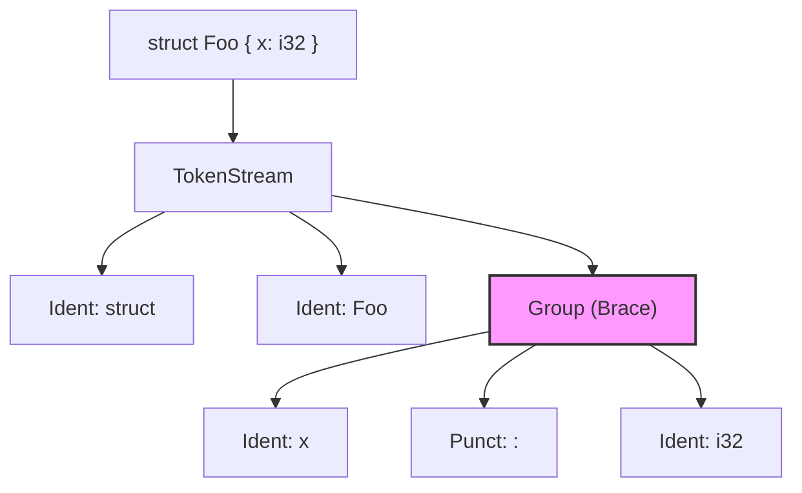

# Chapter 1: Understanding Tokens 🪙

## What You'll Learn

- What `TokenStream` and `TokenTree` are
- The 4 `TokenTree` variants: `Ident`, `Punct`, `Group`, `Literal`
- Why `proc-macro2` exists (and when to use it)
- How to debug TokenStreams with `eprintln!`

---

## Macros See Tokens, Not Text

Here's the key insight that will unlock everything else: **procedural macros don't see your code as text**. They see it as a stream of tokens—the same tokens the Rust compiler uses internally.

Think of it like this: when you write `struct Foo { x: i32 }`, the compiler doesn't see those 22 characters. It sees:

1. An identifier: `struct`
2. An identifier: `Foo`
3. A group of tokens enclosed in `{ }`, containing:
   - An identifier: `x`
   - A punctuation mark: `:`
   - An identifier: `i32`

This is what your macro will receive. Not a string. Not an AST (yet). Just a flat stream of these primitive building blocks.

**💡 Aha!** Once you understand this, everything else makes sense. `syn` is just a fancy way to convert these tokens into structured types. `quote` is just a fancy way to create new tokens. The tokens are the universal currency.

---

## The `proc-macro` Crate

The `proc-macro` crate is part of Rust's standard library and provides the types that represent this token stream. It's your gateway between the compiler and your code.

### TokenStream: The Input and Output

Every procedural macro has this signature pattern:

```rust
use proc_macro::TokenStream;

#[proc_macro]
pub fn my_macro(input: TokenStream) -> TokenStream {
    // Transform input tokens into output tokens
    input  // For now, just return unchanged
}
```

`TokenStream` is literally a stream of tokens. You receive one, and you return one. That's it. Everything else is details.

### TokenTree: The Building Blocks

A `TokenStream` is made of `TokenTree` items. There are exactly **4 variants**:

| Variant | What It Represents | Example |
|---------|-------------------|---------|
| `Ident` | Identifiers and keywords | `struct`, `foo`, `i32`, `pub` |
| `Punct` | Single punctuation characters | `:`, `,`, `<`, `>`, `=` |
| `Group` | Delimited groups | `{ ... }`, `( ... )`, `[ ... ]` |
| `Literal` | Literal values | `42`, `"hello"`, `3.14`, `'a'` |

That's it. Four types. Every piece of Rust code can be broken down into these four building blocks.

### Code Example: Peeking at Tokens

Let's write a simple macro that just prints what it receives:

```rust
use proc_macro::TokenStream;

#[proc_macro]
pub fn debug_tokens(input: TokenStream) -> TokenStream {
    eprintln!("=== Token Debug ===");
    eprintln!("{:#?}", input);
    eprintln!("==================");
    input
}
```

When you call this macro with:

```rust
debug_tokens!(struct Foo { x: i32 });
```

You'll see output like this (during compilation):

```text
=== Token Debug ===
TokenStream [
    Ident {
        ident: "struct",
    },
    Ident {
        ident: "Foo",
    },
    Group {
        delimiter: Brace,
        stream: TokenStream [
            Ident {
                ident: "x",
            },
            Punct {
                char: ':',
                spacing: Alone,
            },
            Ident {
                ident: "i32",
            },
        ],
    },
]
==================
```

Look at that! The nested `Group` contains the field definition. The braces themselves become a `Group` with `delimiter: Brace`.

---

## TokenStream Structure Diagram

Here's how `struct Foo { x: i32 }` becomes tokens:



Notice how the `Group` acts as a container—it has its own nested `TokenStream` inside.

---

## Why `proc-macro2` Exists

You might be wondering: "If `proc_macro::TokenStream` works, why is there a `proc_macro2` crate?"

Great question! Here's the problem:

```rust
// This only compiles inside a proc-macro crate!
use proc_macro::TokenStream;
```

The `proc_macro` crate is **only available inside procedural macro crates** (crates with `proc-macro = true` in Cargo.toml). This creates two problems:

1. **You can't write tests** for code that uses `proc_macro` types
2. **You can't create helper libraries** that work with tokens

### The Solution: `proc-macro2`

`proc-macro2` provides identical types (`TokenStream`, `TokenTree`, etc.) that work **anywhere**:

```rust
// This works in any crate!
use proc_macro2::TokenStream;
```

### Converting Between Them

When you need to go between the two, just use `.into()`:

```rust
use proc_macro::TokenStream;       // The "real" compiler type
use proc_macro2::TokenStream as TokenStream2;  // The portable type

#[proc_macro]
pub fn my_macro(input: TokenStream) -> TokenStream {
    // Convert to proc_macro2 for processing
    let input2: TokenStream2 = input.into();
    
    // ... do stuff with input2 ...
    
    // Convert back to proc_macro for output
    input2.into()
}
```

**💡 Aha!** This is why `syn` and `quote` use `proc_macro2` types—they're libraries that need to work outside proc-macro crates for testing. Your macro's entry point uses `proc_macro::TokenStream`, but internally everything uses `proc_macro2`.

---

## Code Example: Complete Token Inspector

Here's a more complete example that iterates through tokens and identifies each type:

```rust
use proc_macro::TokenStream;
use proc_macro2::TokenTree;

#[proc_macro]
pub fn inspect_tokens(input: TokenStream) -> TokenStream {
    let input2: proc_macro2::TokenStream = input.into();
    
    eprintln!("=== Token Inspector ===");
    for (i, tree) in input2.clone().into_iter().enumerate() {
        match &tree {
            TokenTree::Ident(ident) => {
                eprintln!("[{}] Ident: {}", i, ident);
            }
            TokenTree::Punct(punct) => {
                eprintln!("[{}] Punct: '{}' (spacing: {:?})", 
                    i, punct.as_char(), punct.spacing());
            }
            TokenTree::Group(group) => {
                eprintln!("[{}] Group ({:?}): {} tokens inside", 
                    i, group.delimiter(), group.stream().into_iter().count());
            }
            TokenTree::Literal(lit) => {
                eprintln!("[{}] Literal: {}", i, lit);
            }
        }
    }
    eprintln!("=======================");
    
    input2.into()
}
```

For `inspect_tokens!(fn add(a: u32, b: u32) -> u32)`, you'd see:

```text
=== Token Inspector ===
[0] Ident: fn
[1] Ident: add
[2] Group (Parenthesis): 7 tokens inside
[3] Punct: '-' (spacing: Joint)
[4] Punct: '>' (spacing: Alone)
[5] Ident: u32
=======================
```

Notice how `->` is two separate `Punct` tokens! The first has `spacing: Joint` (indicating another punct follows immediately), and the second has `spacing: Alone`.

---

## Key Takeaways

📌 **Macros receive `TokenStream`, return `TokenStream`** — That's the fundamental contract.

📌 **`TokenTree` has exactly 4 variants** — `Ident`, `Punct`, `Group`, `Literal`. Everything is made of these.

📌 **`proc-macro2` enables testing and library code** — Use it internally; convert at the entry point.

📌 **`eprintln!` is your friend** — Always start debugging by printing `{:#?}` of your input.

📌 **Groups contain nested TokenStreams** — `{ }`, `( )`, and `[ ]` create nested structures.

---

## Try It Yourself

The example in [`examples/01_token_debug/`](./examples/01_token_debug/) implements the token inspector. Try it:

```bash
cd docs/proc_macro_tutorial/examples/01_token_debug
cargo run --example demo 2>&1
```

---

## Next Up

Now that you understand what macros see, let's learn how to make sense of it. Tokens are great, but manually pattern-matching on `Ident`s and `Punct`s would be tedious.

Enter `syn`—the crate that turns token soup into typed structures.

**[Continue to Chapter 2: Parsing with syn →](./02-syn.md)**

