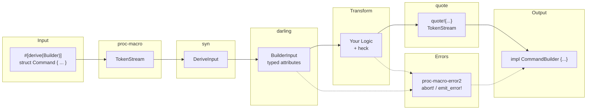

# Chapter 7: The Complete Pipeline 🎯

## What You'll Learn

- How all 7 crates fit together
- The macro expansion pipeline
- Common patterns and idioms
- Reference architecture for derive macros

---

## The Big Picture

You've learned the pieces. Now let's see how they combine.

A procedural macro is a **code transformer**:

```text
Input Rust Code  →  Your Macro  →  Output Rust Code
```

But internally, that transformation flows through stages:

```text
Tokens → Parsed AST → Validated Data → Generated Code → Tokens
```

Each crate handles one stage.

---

## The Macro Pipeline



### The Flow

1. **Rust compiler** calls your macro with raw `TokenStream`
2. **syn** parses tokens into typed `DeriveInput`
3. **darling** extracts attributes into your custom structs
4. **Your logic** transforms parsed data (with `heck` for naming)
5. **quote** generates new code as `TokenStream`
6. **proc-macro-error2** handles any errors along the way
7. **Compiler** receives output `TokenStream` and continues

---

## Walkthrough: Builder Derive Macro

Let's trace through a complete macro implementation:

```rust
use proc_macro::TokenStream;
use proc_macro_error2::proc_macro_error;
use darling::{FromDeriveInput, FromField, ast::Data};
use quote::{quote, format_ident};
use syn::{parse_macro_input, DeriveInput, Ident, Type};
use heck::ToPascalCase;

// ============================================================
// STEP 1: Define what we want to parse (darling)
// ============================================================

#[derive(FromDeriveInput)]
#[darling(attributes(builder), supports(struct_named))]
struct BuilderInput {
    ident: Ident,
    data: Data<(), BuilderField>,
}

#[derive(FromField)]
#[darling(attributes(builder))]
struct BuilderField {
    ident: Option<Ident>,
    ty: Type,
    
    #[darling(default)]
    each: Option<String>,
}

// ============================================================
// STEP 2: Entry point (proc-macro + proc-macro-error2)
// ============================================================

#[proc_macro_derive(Builder, attributes(builder))]
#[proc_macro_error]  // Enables abort! and emit_error!
pub fn derive_builder(input: TokenStream) -> TokenStream {
    // Parse raw tokens into syn's DeriveInput
    let input = parse_macro_input!(input as DeriveInput);
    
    // Parse with darling for typed attribute access
    let parsed = match BuilderInput::from_derive_input(&input) {
        Ok(p) => p,
        Err(e) => return e.write_errors().into(),
    };
    
    // Generate the builder (quote)
    generate_builder(&parsed).into()
}

// ============================================================
// STEP 3: Generate code (quote + heck)
// ============================================================

fn generate_builder(input: &BuilderInput) -> proc_macro2::TokenStream {
    let struct_name = &input.ident;
    
    // Use heck for consistent builder naming
    let builder_name = format_ident!(
        "{}Builder", 
        struct_name.to_string().to_pascal_case()
    );
    
    let fields = input.data
        .as_ref()
        .take_struct()
        .expect("only structs")
        .fields;
    
    // Generate builder struct fields
    let builder_fields = fields.iter().map(|f| {
        let name = f.ident.as_ref().unwrap();
        let ty = &f.ty;
        quote! { #name: Option<#ty> }
    });
    
    // Generate setter methods
    let setters = fields.iter().map(|f| {
        let name = f.ident.as_ref().unwrap();
        let ty = &f.ty;
        
        if let Some(each_name) = &f.each {
            // Handle #[builder(each = "...")]
            let each_ident = format_ident!("{}", each_name);
            quote! {
                pub fn #each_ident(&mut self, item: /* inner type */) -> &mut Self {
                    self.#name.get_or_insert_with(Vec::new).push(item);
                    self
                }
            }
        } else {
            quote! {
                pub fn #name(&mut self, value: #ty) -> &mut Self {
                    self.#name = Some(value);
                    self
                }
            }
        }
    });
    
    // Generate build method
    let field_extracts = fields.iter().map(|f| {
        let name = f.ident.as_ref().unwrap();
        let name_str = name.to_string();
        quote! {
            #name: self.#name.take().ok_or(
                format!("missing field: {}", #name_str)
            )?
        }
    });
    
    quote! {
        pub struct #builder_name {
            #( #builder_fields, )*
        }
        
        impl #builder_name {
            #( #setters )*
            
            pub fn build(&mut self) -> Result<#struct_name, String> {
                Ok(#struct_name {
                    #( #field_extracts, )*
                })
            }
        }
        
        impl #struct_name {
            pub fn builder() -> #builder_name {
                #builder_name {
                    #( #fields.ident: None, )*
                }
            }
        }
    }
}
```

---

## Common Patterns

### Pattern 1: Parse → Validate → Generate

The standard flow:

```rust
#[proc_macro_derive(MyMacro)]
#[proc_macro_error]
pub fn derive(input: TokenStream) -> TokenStream {
    // 1. Parse
    let input = parse_macro_input!(input as DeriveInput);
    let parsed = MyInput::from_derive_input(&input)
        .unwrap_or_else(|e| abort!(input, "{}", e));
    
    // 2. Validate
    validate(&parsed);
    
    // 3. Generate
    generate(&parsed).into()
}
```

### Pattern 2: Struct + Field Iteration

For derive macros that process each field:

```rust
fn generate(input: &MyInput) -> TokenStream {
    let name = &input.ident;
    
    let field_impls = input.fields().iter().map(|field| {
        let field_name = &field.ident;
        let field_ty = &field.ty;
        
        quote! {
            // Per-field code generation
        }
    });
    
    quote! {
        impl #name {
            #( #field_impls )*
        }
    }
}
```

### Pattern 3: Optional Attribute with Default

```rust
#[derive(FromField)]
#[darling(attributes(my_attr))]
struct MyField {
    ident: Option<Ident>,
    ty: Type,
    
    #[darling(default)]
    format: Option<String>,
}

// Usage: if format.is_some() { use it } else { use default }
```

### Pattern 4: Error Accumulation

Check everything, report all errors:

```rust
fn validate(fields: &[MyField]) {
    for field in fields {
        if !condition1(field) {
            emit_error!(field.span(), "condition1 failed");
        }
        if !condition2(field) {
            emit_error!(field.span(), "condition2 failed");
        }
    }
    // All errors shown at once
}
```

---

## Error Handling Patterns

Different situations call for different approaches:

| Situation | Approach |
|-----------|----------|
| Invalid attribute syntax | darling's `write_errors()` |
| Unsupported input type | `abort!(span, "message")` |
| Multiple field validation errors | `emit_error!(span, "message")` |
| Type bound violations | `quote_spanned!` with trait bounds |
| Simple single error | `syn::Error::to_compile_error()` |

### Decision Tree

```text
Is it a parsing error?
├── Yes → Let darling/syn handle it
└── No → Is it fatal (can't continue)?
    ├── Yes → abort!()
    └── No → Can you report multiple?
        ├── Yes → emit_error!()
        └── No → syn::Error::to_compile_error()
```

---

## Testing Your Macros

### During Development: eprintln!

```rust
#[proc_macro_derive(MyMacro)]
pub fn derive(input: TokenStream) -> TokenStream {
    let input = parse_macro_input!(input as DeriveInput);
    
    eprintln!("Parsing struct: {}", input.ident);
    eprintln!("Fields: {:#?}", /* field list */);
    
    // ...
}
```

### View Generated Code: cargo-expand

```bash
cargo +nightly expand --example my_example
```

### Compile Tests: trybuild

```rust
#[test]
fn tests() {
    let t = trybuild::TestCases::new();
    t.pass("tests/01-parse.rs");
    t.compile_fail("tests/02-bad-input.rs");
}
```

---

## Reference: Macro Crate Checklist

### Cargo.toml

```toml
[lib]
proc-macro = true

[dependencies]
# Core (always needed)
syn = { version = "2", features = ["derive", "parsing"] }
quote = "1"
proc-macro2 = "1"

# Recommended
darling = "0.20"           # Complex attribute parsing
proc-macro-error2 = "2"    # Ergonomic error handling
heck = "0.5"               # Case conversion

[dev-dependencies]
trybuild = "1.0"           # Compile tests
```

### Entry Point Template

```rust
use proc_macro::TokenStream;
use proc_macro_error2::proc_macro_error;
use quote::quote;
use syn::{parse_macro_input, DeriveInput};

#[proc_macro_derive(MyMacro, attributes(my_attr))]
#[proc_macro_error]
pub fn derive(input: TokenStream) -> TokenStream {
    let input = parse_macro_input!(input as DeriveInput);
    
    // Parse, validate, generate...
    
    quote! { /* generated code */ }.into()
}
```

---

## Key Takeaways

📌 **Pipeline**: `TokenStream` → `syn` → `darling` → transform → `quote` → `TokenStream`

📌 **Each crate solves one problem well** — Don't fight it, flow with it.

📌 **Always use `#[proc_macro_error]`** — It costs nothing and saves headaches.

📌 **Test with trybuild** — Catches regressions in error messages too.

📌 **Debug with `cargo expand`** — See exactly what you're generating.

📌 **All 7 crates together** — The complete toolkit for production macros.

---

## Congratulations! 🎉

You've completed the Hitchhiker's Guide to Procedural Macros!

You now understand:
- How macros see code as tokens
- How syn parses those tokens
- How quote generates new tokens
- How darling simplifies attributes
- How heck handles naming
- How proc-macro-error2 handles errors
- How they all fit together

Go forth and write macros!

---

## Further Reading

- [The Little Book of Rust Macros](https://danielkeep.github.io/tlborm/book/) — Covers declarative macros too
- [syn documentation](https://docs.rs/syn) — Full API reference
- [quote documentation](https://docs.rs/quote) — All the macros
- [darling documentation](https://docs.rs/darling) — Advanced attribute patterns
- [proc-macro-workshop](https://github.com/dtolnay/proc-macro-workshop) — Practice projects!

---

*[← Previous: Error Handling with proc-macro-error2](./06-errors.md)*

*[Back to Index](./README.md)*

