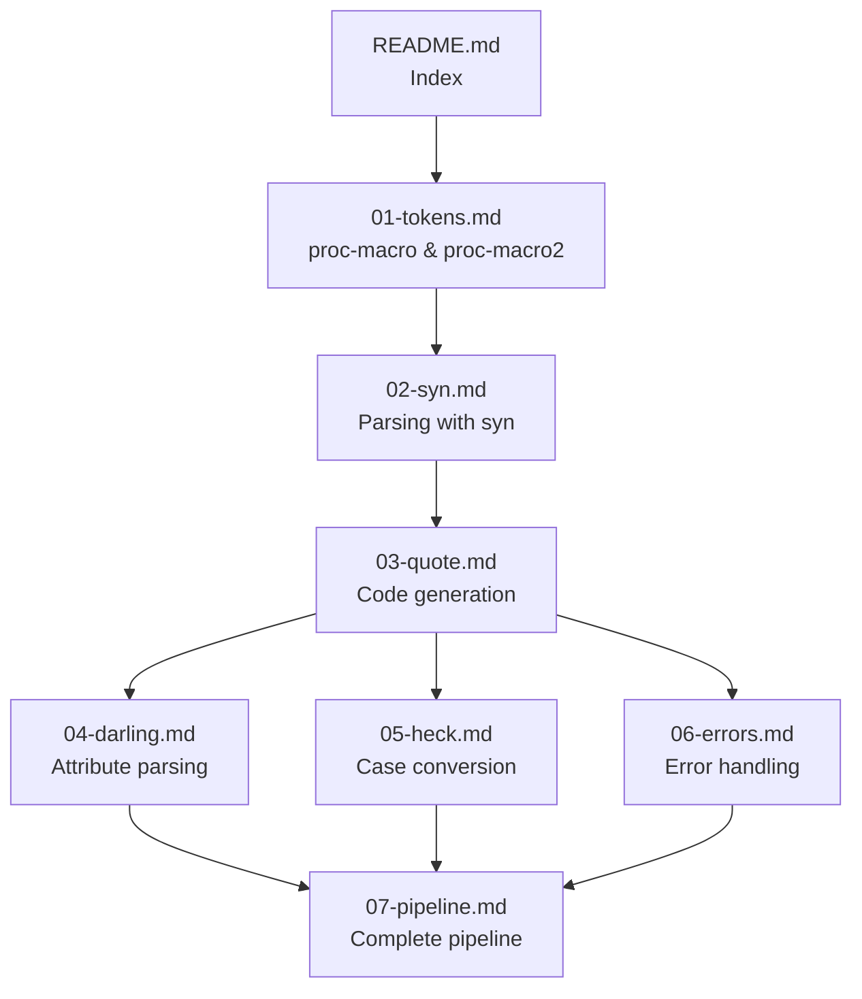

# Data Model: Proc-Macro Tutorial Documentation

**Date**: 2025-12-25  
**Purpose**: Define the structure of documentation entities and their relationships

## Entity Definitions

### Chapter

A standalone markdown file covering one major concept.

| Attribute | Type | Required | Description |
|-----------|------|----------|-------------|
| `id` | string | ✅ | Numeric prefix (01-06) |
| `title` | string | ✅ | Chapter title |
| `crate` | string | ✅ | Primary crate covered |
| `prerequisites` | string[] | ❌ | Chapter IDs that must be read first |
| `estimated_time` | minutes | ✅ | Reading time |
| `concepts` | Concept[] | ✅ | Key concepts introduced |
| `examples` | Example[] | ✅ | Code examples in chapter |
| `diagrams` | Diagram[] | ❌ | Visual diagrams |

**Relationships**:
- Chapter `has many` Concepts
- Chapter `has many` Examples
- Chapter `has many` Diagrams
- Chapter `depends on` Chapters (prerequisites)

---

### Concept

A named idea with definition and connections.

| Attribute | Type | Required | Description |
|-----------|------|----------|-------------|
| `name` | string | ✅ | Concept identifier (e.g., "TokenTree") |
| `definition` | string | ✅ | One-line explanation |
| `crate` | string | ✅ | Which crate provides it |
| `type` | enum | ✅ | struct/enum/trait/macro/function |
| `related` | string[] | ❌ | Names of related concepts |
| `code_signature` | string | ❌ | Rust signature if applicable |

**Concept Inventory**:

| Chapter | Concepts |
|---------|----------|
| 01 | TokenStream, TokenTree, Ident, Punct, Group, Literal, Span |
| 02 | DeriveInput, Data, Fields, Field, Attribute, Meta, parse_macro_input!, Parse |
| 03 | quote!, quote_spanned!, format_ident!, interpolation, repetition |
| 04 | FromDeriveInput, FromField, FromMeta, darling attributes |
| 05 | ToSnakeCase, ToPascalCase, ToCamelCase, case conversion traits |
| 06 | abort!, emit_error!, #[proc_macro_error], error accumulation, span preservation |
| 07 | Pipeline stages, macro flow, patterns |

---

### Example

A compilable code snippet with input, macro code, and output.

| Attribute | Type | Required | Description |
|-----------|------|----------|-------------|
| `id` | string | ✅ | Example identifier |
| `title` | string | ✅ | Descriptive name |
| `input_code` | string | ✅ | The Rust code being processed |
| `macro_code` | string | ✅ | The proc-macro implementation |
| `eprintln_output` | string | ✅ | Debug output from macro |
| `generated_code` | string | ❌ | Output from cargo expand |
| `chapter` | string | ✅ | Which chapter it belongs to |
| `runnable` | boolean | ✅ | Can be run standalone |

**Example Inventory**:

| Chapter | Examples |
|---------|----------|
| 01 | Token printing macro, TokenTree inspection |
| 02 | Struct field enumeration, Attribute extraction |
| 03 | Simple Debug impl, Builder method generation |
| 04 | Before/after darling refactor |
| 05 | Case conversion demo |
| 06 | Complete Builder walkthrough |

---

### Diagram

A visual representation embedded in markdown.

| Attribute | Type | Required | Description |
|-----------|------|----------|-------------|
| `id` | string | ✅ | Diagram identifier |
| `title` | string | ✅ | Caption |
| `type` | enum | ✅ | flowchart/classDiagram/sequence |
| `format` | enum | ✅ | mermaid/ascii |
| `chapter` | string | ✅ | Which chapter it belongs to |
| `requirement` | string | ❌ | FR-xxx it satisfies |

**Diagram Inventory**:

| ID | Title | Type | Chapter | Requirement |
|----|-------|------|---------|-------------|
| D1 | TokenStream Structure | flowchart | 01 | FR-011 |
| D2 | syn Type Hierarchy | classDiagram | 02 | FR-012 |
| D3 | Macro Pipeline | flowchart | 07 | FR-013 |
| D4 | Darling Before/After | flowchart | 04 | FR-014 |

---

### Crate

One of the 7 crates being documented.

| Attribute | Type | Required | Description |
|-----------|------|----------|-------------|
| `name` | string | ✅ | Crate name |
| `version` | string | ✅ | Version documented |
| `purpose` | string | ✅ | One-line purpose |
| `docs_url` | string | ✅ | Official documentation URL |
| `chapter` | string | ✅ | Primary chapter covering it |
| `key_types` | string[] | ✅ | Most important types |

**Crate Inventory**:

| Crate | Version | Chapter | Key Types |
|-------|---------|---------|-----------|
| proc-macro | std | 01 | TokenStream, TokenTree |
| proc-macro2 | 1.x | 01 | TokenStream, Span |
| syn | 2.x | 02 | DeriveInput, Data, Fields |
| quote | 1.x | 03 | quote!, format_ident! |
| darling | 0.20.x | 04 | FromDeriveInput, FromField |
| heck | 0.5.x | 05 | ToSnakeCase, ToPascalCase |
| proc-macro-error2 | 2.x | 06 | abort!, emit_error!, #[proc_macro_error] |

---

## Chapter Dependency Graph

**Reading Order**:
1. 01-tokens (required first)
2. 02-syn (requires 01)
3. 03-quote (requires 02)
4. 04-darling, 05-heck, OR 06-errors (all require 03, independent of each other)
5. 07-pipeline (requires all previous)

---

## File Naming Convention

| Entity Type | Pattern | Example |
|-------------|---------|---------|
| Chapter | `NN-slug.md` | `02-syn.md` |
| Example project | `NN-slug/` | `examples/02-parse-struct/` |
| Contract | `NN-slug.md` | `contracts/02-syn.md` |

---

## Validation Rules

1. **Chapter prerequisites**: Must reference existing chapter IDs
2. **Concept crate**: Must be one of the 6 documented crates
3. **Example chapter**: Must reference valid chapter ID
4. **Diagram format**: Must be "mermaid" or "ascii"
5. **Estimated time**: Must be ≤20 minutes per chapter (SC-002)

