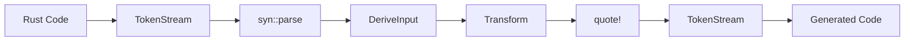

# Research: Proc-Macro Tutorial Documentation

**Date**: 2025-12-25  
**Purpose**: Consolidate research findings for educational documentation about proc-macro crates

## Crate Research Summary

### 1. proc-macro (Standard Library)

**Official Docs**: https://doc.rust-lang.org/proc_macro/

**Key Types to Document**:
| Type | Purpose | Tutorial Focus |
|------|---------|----------------|
| `TokenStream` | Stream of tokens passed to/from macros | Entry/exit point of all macros |
| `TokenTree` | Individual token unit (4 variants) | Core abstraction |
| `Ident` | Identifier token | Variable/type names |
| `Punct` | Punctuation token | Operators, delimiters |
| `Group` | Delimited group `()`, `[]`, `{}` | Nested structures |
| `Literal` | Literal values | Strings, numbers |
| `Span` | Source location info | Error reporting |

**Limitations to Explain**:
- Can only be used inside proc-macro crates
- Limited to TokenStream operations
- No direct AST access

**Decision**: Start here because it's the foundation that everything else builds upon.

**Rationale**: Readers must understand that macros see tokens, not text or AST, before higher abstractions make sense.

---

### 2. proc-macro2

**Official Docs**: https://docs.rs/proc-macro2/latest/proc_macro2/

**Key Types to Document**:
| Type | Purpose | Difference from std |
|------|---------|---------------------|
| `TokenStream` | Same as std, but usable outside proc-macro crates | Testing, libraries |
| `TokenTree` | Same 4 variants | Interop with syn/quote |
| `Span` | Extended span support | Better error locations |

**Why It Exists**:
1. proc-macro crate only works inside proc-macro crates
2. Testing and utilities need TokenStream outside proc-macro context
3. syn and quote are built on proc-macro2

**Conversion**:
```rust
// proc-macro → proc-macro2
let pm2_stream: proc_macro2::TokenStream = pm_stream.into();

// proc-macro2 → proc-macro
let pm_stream: proc_macro::TokenStream = pm2_stream.into();
```

**Decision**: Cover immediately after proc-macro, as bridge concept.

**Rationale**: Explains why syn/quote work and enables testing demonstrations.

---

### 3. syn (Syntax Parsing)

**Official Docs**: https://docs.rs/syn/latest/syn/

**Key Types for Derive Macros**:
| Type | Purpose | Common Usage |
|------|---------|--------------|
| `DeriveInput` | Parsed derive macro input | Entry point for all derives |
| `Data` | Enum: Struct/Enum/Union | Branch on input type |
| `Fields` | Named/Unnamed/Unit | Iterate struct fields |
| `Field` | Single field with name, type, attrs | Per-field processing |
| `Ident` | Identifier (from proc-macro2) | Names |
| `Type` | Rust type representation | Field types |
| `Generics` | Generic parameters | Lifetime/type params |
| `Attribute` | Parsed attribute | Helper attributes |
| `Meta` | Attribute content structure | Nested attribute parsing |

**Key Types for Attribute/Function-like Macros**:
| Type | Purpose |
|------|---------|
| `ItemStruct` | Complete struct definition |
| `ItemEnum` | Complete enum definition |
| `ItemFn` | Function definition |
| `Expr` | Rust expressions |

**Parse Trait**:
```rust
use syn::parse_macro_input;
let input = parse_macro_input!(tokens as DeriveInput);
```

**Feature Flags**:
| Flag | When to Enable |
|------|----------------|
| `derive` | Derive macros (DeriveInput) |
| `parsing` | Parse trait implementations |
| `full` | Expression/statement parsing |
| `extra-traits` | Debug impls (dev only!) |

**Decision**: Core chapter, most detailed coverage.

**Rationale**: syn is the workhorse of the ecosystem. Deep understanding unlocks all macro development.

---

### 4. quote (Code Generation)

**Official Docs**: https://docs.rs/quote/latest/quote/

**Key Macros**:
| Macro | Purpose |
|-------|---------|
| `quote!` | Generate TokenStream from Rust-like syntax |
| `quote_spanned!` | Same but with explicit span |
| `format_ident!` | Create identifiers with formatting |

**Interpolation Syntax**:
```rust
// Simple variable
quote! { let #name = #value; }

// Repetition
quote! { #(#fields),* }

// With separator
quote! { #(#items)|* }

// Nested repetition
quote! { #( #(#inner)* )* }
```

**Span Preservation**:
```rust
quote_spanned! { field.span() =>
    compile_error!("bad field");
}
```

**Decision**: Equal weight to syn—the output side of the equation.

**Rationale**: Can't write useful macros without code generation. Completes the core pipeline.

---

### 5. darling (Attribute Parsing)

**Official Docs**: https://docs.rs/darling/latest/darling/

**Key Traits**:
| Trait | Level | Purpose |
|-------|-------|---------|
| `FromDeriveInput` | Struct | Parse entire derive input |
| `FromField` | Field | Parse per-field attributes |
| `FromMeta` | Attribute | Parse attribute values |
| `FromVariant` | Variant | Parse enum variants |

**Before/After Example**:

**Before (manual parsing)**:
```rust
fn get_each_attr(attrs: &[Attribute]) -> Option<String> {
    for attr in attrs {
        if !attr.path().is_ident("builder") { continue; }
        if let Meta::List(list) = &attr.meta {
            let nested = list.parse_args_with(...)?;
            for meta in nested {
                if let Meta::NameValue(nv) = meta {
                    if nv.path.is_ident("each") {
                        // 8 levels of nesting!
                    }
                }
            }
        }
    }
    None
}
```

**After (darling)**:
```rust
#[derive(FromField)]
#[darling(attributes(builder))]
struct BuilderField {
    ident: Option<Ident>,
    ty: Type,
    #[darling(default)]
    each: Option<String>,
}
```

**Key Attributes**:
| Attribute | Purpose |
|-----------|---------|
| `#[darling(attributes(name))]` | Which attributes to parse |
| `#[darling(default)]` | Optional with Default value |
| `#[darling(rename = "x")]` | Different attribute name |
| `#[darling(forward_attrs)]` | Preserve raw attributes |

**Decision**: Show as "ergonomics upgrade" after mastering manual parsing.

**Rationale**: Demonstrates progression from understanding to optimization.

---

### 6. heck (Case Conversion)

**Official Docs**: https://docs.rs/heck/latest/heck/

**Key Traits**:
| Trait | Output Example |
|-------|----------------|
| `ToSnakeCase` | `field_name` |
| `ToPascalCase` | `FieldName` |
| `ToCamelCase` | `fieldName` |
| `ToKebabCase` | `field-name` |
| `ToShoutySnakeCase` | `FIELD_NAME` |
| `ToTitleCase` | `Field Name` |

**Usage**:
```rust
use heck::ToSnakeCase;
let method_name = format!("get_{}", field.to_snake_case());
```

**Decision**: Brief "utility spotlight" showing practical value.

**Rationale**: Small crate, big impact. Shows the ecosystem's depth.

---

## Diagram Research

### Mermaid Compatibility

**Tested Renderers**:
- ✅ GitHub markdown
- ✅ VS Code (with built-in preview)
- ✅ GitLab
- ✅ Notion
- ⚠️ Some static site generators need plugins

**Diagram Types to Use**:
| Diagram | Mermaid Syntax | Use Case |
|---------|----------------|----------|
| Flowchart | `graph TD` | Pipeline, data flow |
| Class diagram | `classDiagram` | Type relationships |
| Sequence | `sequenceDiagram` | Macro expansion steps |

**Example Pipeline Flowchart**:


---

## Alternatives Considered

| Decision | Chosen | Alternatives | Why Rejected |
|----------|--------|--------------|--------------|
| Diagram format | Mermaid | ASCII art, PlantUML, images | Mermaid has best GitHub support |
| Chapter structure | One file per crate | Single long document | Better navigation, focused reading |
| Example format | Standalone Cargo projects | Inline code only | Readers can actually run examples |
| Tone | Conversational | Academic formal | Spec requires "entertaining" |
| Prerequisites | Basic Rust only | Some macro experience | Broader audience, spec requirement |

---

## Key Insights for Tutorial

1. **The "Aha!" moments**:
   - Macros see tokens, not text or AST
   - proc-macro2 exists for testability
   - syn turns tokens into typed structures
   - quote is "reverse syn"
   - darling is "serde for attributes"

2. **Building narrative**:
   - TokenStream → "too low level, I want structure"
   - syn → "parsing great, but generating is tedious"
   - quote → "generation great, but attributes are messy"
   - darling → "now it's all declarative!"

3. **Error handling progression**:
   - syn::Error::to_compile_error() for simple cases
   - quote_spanned! for location-preserving errors
   - darling's built-in "did you mean?" suggestions

