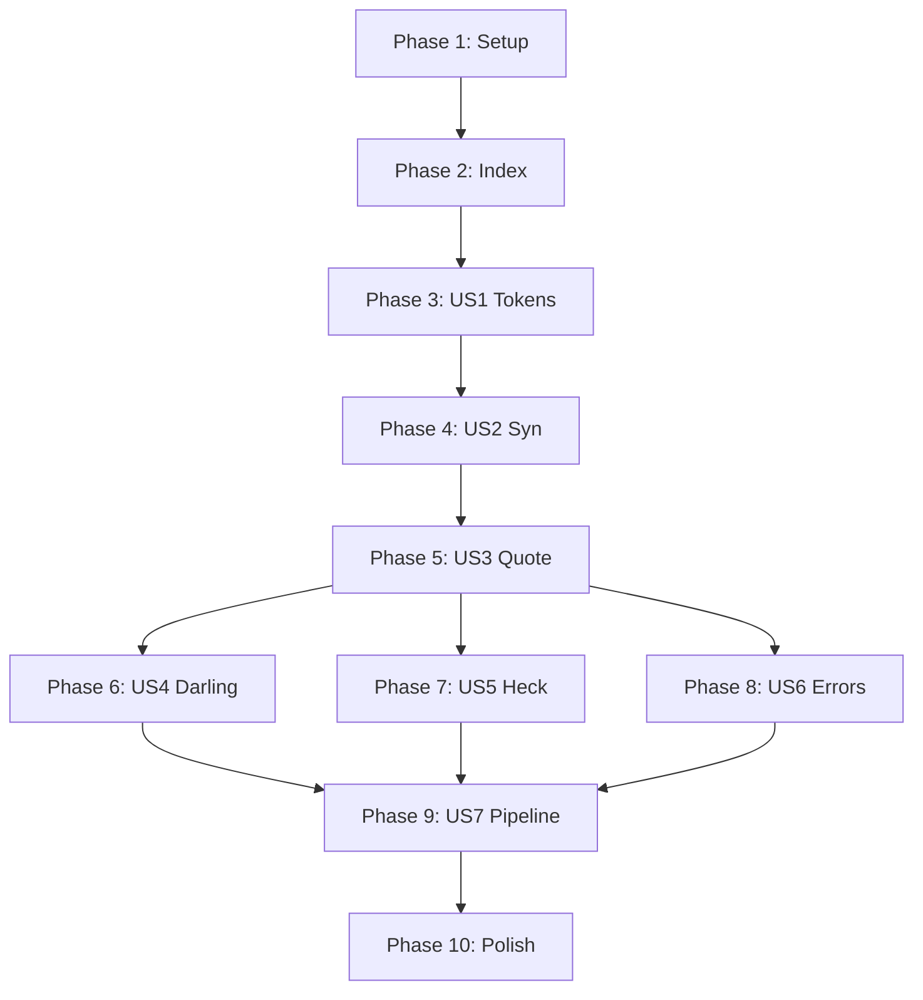

# Tasks: Proc-Macro Tutorial Documentation

**Input**: Design documents from `/specs/002-proc-macro-tutorial/`  
**Prerequisites**: plan.md ✅, spec.md ✅, research.md ✅, data-model.md ✅, contracts/ ✅

**Tests**: Not applicable (documentation project - validation via manual review and code example compilation)

**Organization**: Tasks grouped by user story (chapter) to enable independent writing and review

## Format: `[ID] [P?] [Story] Description`

- **[P]**: Can run in parallel (different files, no dependencies)
- **[Story]**: Which user story this task belongs to (US1-US7)
- Include exact file paths in descriptions
- **Note**: FR-019 ("Aha! moments") is embedded in chapter content tasks, not tracked separately

## Path Conventions

Documentation structure from plan.md:
```
docs/proc-macro-tutorial/
├── README.md
├── 01-tokens.md
├── 02-syn.md
├── 03-quote.md
├── 04-darling.md
├── 05-heck.md
├── 06-errors.md
├── 07-pipeline.md
└── examples/
    ├── 01-token-debug/
    ├── 02-parse-struct/
    ├── 03-generate-impl/
    ├── 04-darling-attrs/
    ├── 05-case-convert/
    └── 06-error-handling/
```

---

## Phase 1: Setup (Directory Structure)

**Purpose**: Create documentation directory and example project scaffolding

- [x] T001 Create documentation directory structure at `docs/proc-macro-tutorial/`
- [x] T002 [P] Create example project scaffold `docs/proc-macro-tutorial/examples/01-token-debug/` with Cargo.toml
- [x] T003 [P] Create example project scaffold `docs/proc-macro-tutorial/examples/02-parse-struct/` with Cargo.toml
- [x] T004 [P] Create example project scaffold `docs/proc-macro-tutorial/examples/03-generate-impl/` with Cargo.toml
- [x] T005 [P] Create example project scaffold `docs/proc-macro-tutorial/examples/04-darling-attrs/` with Cargo.toml
- [x] T006 [P] Create example project scaffold `docs/proc-macro-tutorial/examples/05-case-convert/` with Cargo.toml
- [x] T007 [P] Create example project scaffold `docs/proc-macro-tutorial/examples/06-error-handling/` with Cargo.toml

**Checkpoint**: Directory structure ready for content

---

## Phase 2: Foundational (Index & Cross-Cutting)

**Purpose**: Create the tutorial index and establish common elements

- [x] T008 Write tutorial index with chapter links in `docs/proc-macro-tutorial/README.md`
- [x] T009 Add "The Crate Ecosystem" overview table (7 crates) to `docs/proc-macro-tutorial/README.md`
- [x] T010 Add "How to Read This Tutorial" section to `docs/proc-macro-tutorial/README.md`
- [x] T011 Add "Running the Examples" instructions to `docs/proc-macro-tutorial/README.md`

**Checkpoint**: Index complete - chapter writing can begin

---

## Phase 3: User Story 1 - Understanding Tokens (Priority: P1) 🎯 MVP

**Goal**: Teach TokenStream and proc-macro2 fundamentals

**Independent Test**: Reader can explain TokenTree variants and debug tokens with eprintln!

### Chapter Content

- [x] T012 [US1] Write "What You'll Learn" section in `docs/proc-macro-tutorial/01-tokens.md`
- [x] T013 [US1] Write "Macros See Tokens, Not Text" introduction in `docs/proc-macro-tutorial/01-tokens.md`
- [x] T014 [US1] Write TokenStream and TokenTree explanation in `docs/proc-macro-tutorial/01-tokens.md`
- [x] T015 [US1] Create TokenStream structure Mermaid diagram (FR-011) in `docs/proc-macro-tutorial/01-tokens.md`
- [x] T016 [US1] Write "Why proc-macro2 Exists" section in `docs/proc-macro-tutorial/01-tokens.md`
- [x] T017 [US1] Write "Key Takeaways" conclusion in `docs/proc-macro-tutorial/01-tokens.md`

### Example Code

- [x] T018 [US1] Implement token debug macro in `docs/proc-macro-tutorial/examples/01-token-debug/src/lib.rs`
- [x] T019 [US1] Add usage example with eprintln output in `docs/proc-macro-tutorial/examples/01-token-debug/examples/demo.rs`
- [x] T020 [US1] Verify example compiles: `cd docs/proc-macro-tutorial/examples/01-token-debug && cargo check`

**Checkpoint**: Chapter 1 complete and testable independently

---

## Phase 4: User Story 2 - Parsing with Syn (Priority: P1)

**Goal**: Teach syn's structured parsing of Rust syntax

**Independent Test**: Reader can parse a struct and iterate its fields

### Chapter Content

- [x] T021 [US2] Write "What You'll Learn" section in `docs/proc-macro-tutorial/02-syn.md`
- [x] T022 [US2] Write "Tokens Are Too Low-Level" problem statement in `docs/proc-macro-tutorial/02-syn.md`
- [x] T023 [US2] Write DeriveInput explanation with code examples in `docs/proc-macro-tutorial/02-syn.md`
- [x] T024 [US2] Write Data enum and Fields explanation in `docs/proc-macro-tutorial/02-syn.md`
- [x] T025 [US2] Create syn type hierarchy Mermaid diagram (FR-012) in `docs/proc-macro-tutorial/02-syn.md`
- [x] T026 [US2] Write attribute parsing section in `docs/proc-macro-tutorial/02-syn.md`
- [x] T027 [US2] Write feature flags guidance in `docs/proc-macro-tutorial/02-syn.md`
- [x] T028 [US2] Write "Key Takeaways" conclusion in `docs/proc-macro-tutorial/02-syn.md`

### Example Code

- [x] T029 [US2] Implement struct parser macro in `docs/proc-macro-tutorial/examples/02-parse-struct/src/lib.rs`
- [x] T030 [US2] Add usage example with eprintln output in `docs/proc-macro-tutorial/examples/02-parse-struct/examples/demo.rs`
- [x] T031 [US2] Verify example compiles: `cd docs/proc-macro-tutorial/examples/02-parse-struct && cargo check`

**Checkpoint**: Chapter 2 complete and testable independently

---

## Phase 5: User Story 3 - Code Generation with Quote (Priority: P1)

**Goal**: Teach quote's quasi-quoting for code generation

**Independent Test**: Reader can generate an impl block with field iteration

### Chapter Content

- [x] T032 [US3] Write "What You'll Learn" section in `docs/proc-macro-tutorial/03-quote.md`
- [x] T033 [US3] Write "Building TokenStreams Manually" problem statement in `docs/proc-macro-tutorial/03-quote.md`
- [x] T034 [US3] Write basic quote! usage with examples in `docs/proc-macro-tutorial/03-quote.md`
- [x] T035 [US3] Write variable interpolation (#var) explanation in `docs/proc-macro-tutorial/03-quote.md`
- [x] T036 [US3] Write repetition syntax (#(...)* ) explanation in `docs/proc-macro-tutorial/03-quote.md`
- [x] T037 [US3] Write quote_spanned! for error locations in `docs/proc-macro-tutorial/03-quote.md`
- [x] T038 [US3] Write format_ident! usage in `docs/proc-macro-tutorial/03-quote.md`
- [x] T039 [US3] Write "Key Takeaways" conclusion in `docs/proc-macro-tutorial/03-quote.md`

### Example Code

- [x] T040 [US3] Implement Debug derive macro in `docs/proc-macro-tutorial/examples/03-generate-impl/src/lib.rs`
- [x] T041 [US3] Add usage example with cargo expand output in `docs/proc-macro-tutorial/examples/03-generate-impl/examples/demo.rs`
- [x] T042 [US3] Verify example compiles: `cd docs/proc-macro-tutorial/examples/03-generate-impl && cargo check`

**Checkpoint**: Chapter 3 complete - core pipeline (parse→generate) now documented

---

## Phase 6: User Story 4 - Ergonomic Attributes with Darling (Priority: P2)

**Goal**: Teach declarative attribute parsing with darling

**Independent Test**: Reader can refactor manual parsing to use darling traits

### Chapter Content

- [x] T043 [US4] Write "What You'll Learn" section in `docs/proc-macro-tutorial/04-darling.md`
- [x] T044 [US4] Write manual attribute parsing "before" example in `docs/proc-macro-tutorial/04-darling.md`
- [x] T045 [US4] Create before/after comparison diagram (FR-014) in `docs/proc-macro-tutorial/04-darling.md`
- [x] T046 [US4] Write FromDeriveInput explanation in `docs/proc-macro-tutorial/04-darling.md`
- [x] T047 [US4] Write FromField explanation in `docs/proc-macro-tutorial/04-darling.md`
- [x] T048 [US4] Write darling attributes cheat sheet in `docs/proc-macro-tutorial/04-darling.md`
- [x] T049 [US4] Write error handling magic section in `docs/proc-macro-tutorial/04-darling.md`
- [x] T050 [US4] Write "Key Takeaways" conclusion in `docs/proc-macro-tutorial/04-darling.md`

### Example Code

- [x] T051 [US4] Implement manual parsing version in `docs/proc-macro-tutorial/examples/04-darling-attrs/src/manual.rs`
- [x] T052 [US4] Implement darling version in `docs/proc-macro-tutorial/examples/04-darling-attrs/src/lib.rs`
- [x] T053 [US4] Add usage example in `docs/proc-macro-tutorial/examples/04-darling-attrs/examples/demo.rs`
- [x] T054 [US4] Verify example compiles: `cd docs/proc-macro-tutorial/examples/04-darling-attrs && cargo check`

**Checkpoint**: Chapter 4 complete and testable independently

---

## Phase 7: User Story 5 - Case Conversion with Heck (Priority: P3)

**Goal**: Teach heck's case conversion utilities

**Independent Test**: Reader can use heck to transform identifiers

### Chapter Content

- [x] T055 [US5] Write "What You'll Learn" section in `docs/proc-macro-tutorial/05-heck.md`
- [x] T056 [US5] Write case conversion problem statement in `docs/proc-macro-tutorial/05-heck.md`
- [x] T057 [US5] Write case conversion traits table in `docs/proc-macro-tutorial/05-heck.md`
- [x] T058 [US5] Write usage examples with format_ident! in `docs/proc-macro-tutorial/05-heck.md`
- [x] T059 [US5] Write common patterns section in `docs/proc-macro-tutorial/05-heck.md`
- [x] T060 [US5] Write "Key Takeaways" conclusion in `docs/proc-macro-tutorial/05-heck.md`

### Example Code

- [x] T061 [US5] Implement case conversion macro in `docs/proc-macro-tutorial/examples/05-case-convert/src/lib.rs`
- [x] T062 [US5] Add usage example in `docs/proc-macro-tutorial/examples/05-case-convert/examples/demo.rs`
- [x] T063 [US5] Verify example compiles: `cd docs/proc-macro-tutorial/examples/05-case-convert && cargo check`

**Checkpoint**: Chapter 5 complete and testable independently

---

## Phase 8: User Story 6 - Error Handling with proc-macro-error2 (Priority: P2)

**Goal**: Teach ergonomic error handling that eliminates boilerplate

**Independent Test**: Reader can refactor manual error handling to use abort! and emit_error!

### Chapter Content

- [x] T064 [US6] Write "What You'll Learn" section in `docs/proc-macro-tutorial/06-errors.md`
- [x] T065 [US6] Write "Error Handling Matters" introduction in `docs/proc-macro-tutorial/06-errors.md`
- [x] T066 [US6] Write manual error handling problem statement in `docs/proc-macro-tutorial/06-errors.md`
- [x] T067 [US6] Write proc-macro-error2 solution explanation in `docs/proc-macro-tutorial/06-errors.md`
- [x] T068 [US6] Write core macros table (abort!, emit_error!, etc.) in `docs/proc-macro-tutorial/06-errors.md`
- [x] T069 [US6] Write before/after comparison in `docs/proc-macro-tutorial/06-errors.md`
- [x] T070 [US6] Write error accumulation pattern in `docs/proc-macro-tutorial/06-errors.md`
- [x] T071 [US6] Write integration with darling section in `docs/proc-macro-tutorial/06-errors.md`
- [x] T072 [US6] Write "Key Takeaways" conclusion in `docs/proc-macro-tutorial/06-errors.md`

### Example Code

- [x] T073 [US6] Implement manual error handling version in `docs/proc-macro-tutorial/examples/06-error-handling/src/manual.rs`
- [x] T074 [US6] Implement proc-macro-error2 version in `docs/proc-macro-tutorial/examples/06-error-handling/src/lib.rs`
- [x] T075 [US6] Add usage example in `docs/proc-macro-tutorial/examples/06-error-handling/examples/demo.rs`
- [x] T076 [US6] Verify example compiles: `cd docs/proc-macro-tutorial/examples/06-error-handling && cargo check`

**Checkpoint**: Chapter 6 complete and testable independently

---

## Phase 9: User Story 7 - Complete Pipeline (Priority: P2)

**Goal**: Synthesize all 7 crates into unified mental model

**Independent Test**: Reader can trace a macro through all pipeline stages

### Chapter Content

- [x] T077 [US7] Write "What You'll Learn" section in `docs/proc-macro-tutorial/07-pipeline.md`
- [x] T078 [US7] Write "The Big Picture" introduction in `docs/proc-macro-tutorial/07-pipeline.md`
- [x] T079 [US7] Create macro pipeline Mermaid diagram (FR-013) in `docs/proc-macro-tutorial/07-pipeline.md`
- [x] T080 [US7] Write annotated Builder macro walkthrough in `docs/proc-macro-tutorial/07-pipeline.md`
- [x] T081 [US7] Write common patterns section in `docs/proc-macro-tutorial/07-pipeline.md`
- [x] T082 [US7] Write error handling patterns (including proc-macro-error2) in `docs/proc-macro-tutorial/07-pipeline.md`
- [x] T083 [US7] Write testing macros section in `docs/proc-macro-tutorial/07-pipeline.md`
- [x] T084 [US7] Write reference checklist (7 crates) in `docs/proc-macro-tutorial/07-pipeline.md`
- [x] T085 [US7] Write "Key Takeaways" conclusion in `docs/proc-macro-tutorial/07-pipeline.md`

**Checkpoint**: Chapter 7 complete - full tutorial now available

---

## Phase 10: Polish & Validation

**Purpose**: Cross-cutting quality improvements and validation

- [x] T086 [P] Add cross-references between chapters in all `docs/proc-macro-tutorial/*.md`
- [x] T087 [P] Add "Learn More" external links to all 7 chapters
- [x] T088 Verify all Mermaid diagrams render in GitHub preview
- [x] T089 Verify all code examples compile: `for d in docs/proc-macro-tutorial/examples/*/; do (cd "$d" && cargo check); done`
- [x] T090 Review tone for conversational style per FR-016
- [x] T091 Verify each chapter readable in <20 minutes (SC-002)
- [x] T092 Final proofreading pass on all chapters

**Checkpoint**: Tutorial complete and validated

---

## Dependencies & Execution Order

### Phase Dependencies



### User Story Dependencies

| Story | Depends On | Can Start After |
|-------|------------|-----------------|
| US1 (Tokens) | Index | Phase 2 complete |
| US2 (Syn) | US1 | Chapter 1 complete |
| US3 (Quote) | US2 | Chapter 2 complete |
| US4 (Darling) | US3 | Chapter 3 complete |
| US5 (Heck) | US3 | Chapter 3 complete |
| US6 (Errors) | US3 | Chapter 3 complete |
| US7 (Pipeline) | US4, US5, US6 | Chapters 4, 5, & 6 complete |

### Parallel Opportunities

**Within Phase 1 (Setup)**:
- T002-T007 can all run in parallel (different directories)

**Within Each Chapter Phase**:
- Content writing and example code can proceed in parallel
- Different sections marked [P] can run in parallel

**Chapters 4, 5, & 6**:
- US4 (Darling), US5 (Heck), and US6 (Errors) can be written in parallel after US3 complete

---

## Parallel Example: Phase 1

```bash
# All example scaffolds can be created simultaneously:
T002: "Create example project scaffold docs/proc-macro-tutorial/examples/01-token-debug/"
T003: "Create example project scaffold docs/proc-macro-tutorial/examples/02-parse-struct/"
T004: "Create example project scaffold docs/proc-macro-tutorial/examples/03-generate-impl/"
T005: "Create example project scaffold docs/proc-macro-tutorial/examples/04-darling-attrs/"
T006: "Create example project scaffold docs/proc-macro-tutorial/examples/05-case-convert/"
T007: "Create example project scaffold docs/proc-macro-tutorial/examples/06-error-handling/"
```

---

## Implementation Strategy

### MVP First (Chapters 1-3 Only)

1. Complete Phase 1: Setup
2. Complete Phase 2: Index
3. Complete Phase 3: US1 (Tokens)
4. Complete Phase 4: US2 (Syn)
5. Complete Phase 5: US3 (Quote)
6. **STOP and VALIDATE**: Core pipeline documented, tutorial usable
7. Deploy/share if ready

### Incremental Delivery

1. Setup + Index → Navigation ready
2. Add Chapter 1 (Tokens) → Foundation documented
3. Add Chapter 2 (Syn) → Parsing documented
4. Add Chapter 3 (Quote) → Generation documented (MVP complete!)
5. Add Chapter 4 (Darling) → Advanced attribute parsing
6. Add Chapter 5 (Heck) → Utility crate
7. Add Chapter 6 (Errors) → Error handling patterns
8. Add Chapter 7 (Pipeline) → Synthesis complete
9. Polish → Tutorial finalized

---

## Summary

| Metric | Count |
|--------|-------|
| **Total Tasks** | 92 |
| **Setup Tasks** | 7 |
| **Foundational Tasks** | 4 |
| **US1 Tasks** | 9 |
| **US2 Tasks** | 11 |
| **US3 Tasks** | 11 |
| **US4 Tasks** | 12 |
| **US5 Tasks** | 9 |
| **US6 Tasks (Errors)** | 13 |
| **US7 Tasks (Pipeline)** | 9 |
| **Polish Tasks** | 7 |
| **Parallel Opportunities** | 18+ tasks |
| **Required Diagrams** | 4 (FR-011, FR-012, FR-013, FR-014) |

---

## Notes

- [P] tasks = different files, no dependencies
- [US*] label maps task to specific user story for traceability (US1-US7)
- Each chapter can be validated independently
- Code examples must compile before chapter is complete
- Mermaid diagrams must render in GitHub
- Commit after each task or logical group
- proc-macro-error2 is covered in US6 (Chapter 6)

